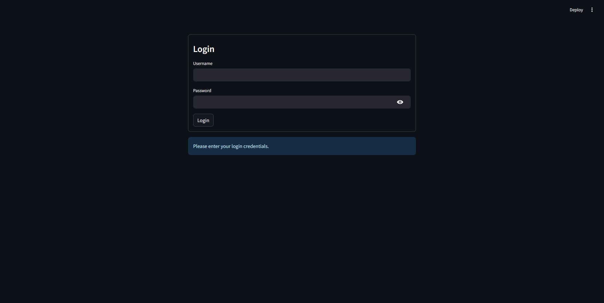
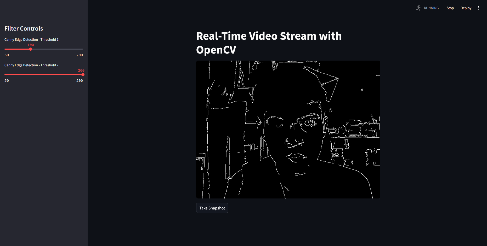

# 🧠 Streamlit Activities Collection

This repository contains 6 hands-on Streamlit projects that explore different capabilities of the Streamlit framework—from basic UI components and file handling to real-time computer vision and database interaction. Each activity demonstrates a core data or visualization concept and is organized for easy learning and reuse.

---

## 📋 Activities Overview

### I. 👋 Hello, Streamlit!
- **Objective:** Understand basic components of a Streamlit app.
- **Explanation:** This activity introduces Streamlit fundamentals including `st.title`, `st.header`, and input elements like `st.text_input` and `st.number_input`. The app dynamically greets the user and echoes their input.
- **Screenshot:**  
  

---

### II. 📄 DataFrame Viewer
- **Objective:** Load and display CSV data interactively.
- **Explanation:** Users can upload a CSV file, view its content using `st.dataframe`, toggle raw data visibility with a checkbox, and filter by column using `st.selectbox`.
- **Screenshot:**  
  
  

---

### III. 🧱 Sidebar and Layout
- **Objective:** Organize content using Streamlit layout components.
- **Explanation:** This app uses `st.sidebar` for filtering values, `st.columns` to organize content horizontally, and `st.expander` to reveal additional info. Content is themed around Data Warehousing and Enterprise Data Management.
- **Screenshot:**  
  

---

### IV. 🔌 Fetch and Display API Data
- **Objective:** Retrieve and visualize data from an external API.
- **Explanation:** This activity makes use of Python’s `requests` library to fetch JSON data (e.g., weather, currency, or COVID stats) and displays it using Streamlit widgets like `st.metric`, `st.table`, and `st.json`.
- **Screenshot:**  
  
  
  
  

---

### V. 🗄️ Data Pipeline with Database
- **Objective:** Build a pipeline that inserts and retrieves data from a database.
- **Explanation:** The app takes user inputs and stores them into an SQLite database (or any other supported backend). It then retrieves and displays the stored data in real-time using `pandas` and `st.dataframe`.
- **Screenshot:**  
  
  

---

### VI. 🎥 Real-Time Video Stream with OpenCV
- **Objective:** Display live webcam feed inside a Streamlit app.
- **Explanation:** This activity uses OpenCV to access the webcam and integrates with Streamlit to display live video. A Canny Edge Detection filter is applied to each frame in real-time, enhancing edges and outlines. This setup is useful for real-time face detection, object tracking, or other computer vision applications where edge-based feature extraction is beneficial.
- **Screenshot:**  
  
  

---

## 🛠️ How to Run

1. Install required packages:
   ```bash
   pip install streamlit pandas requests opencv-python sqlite3
